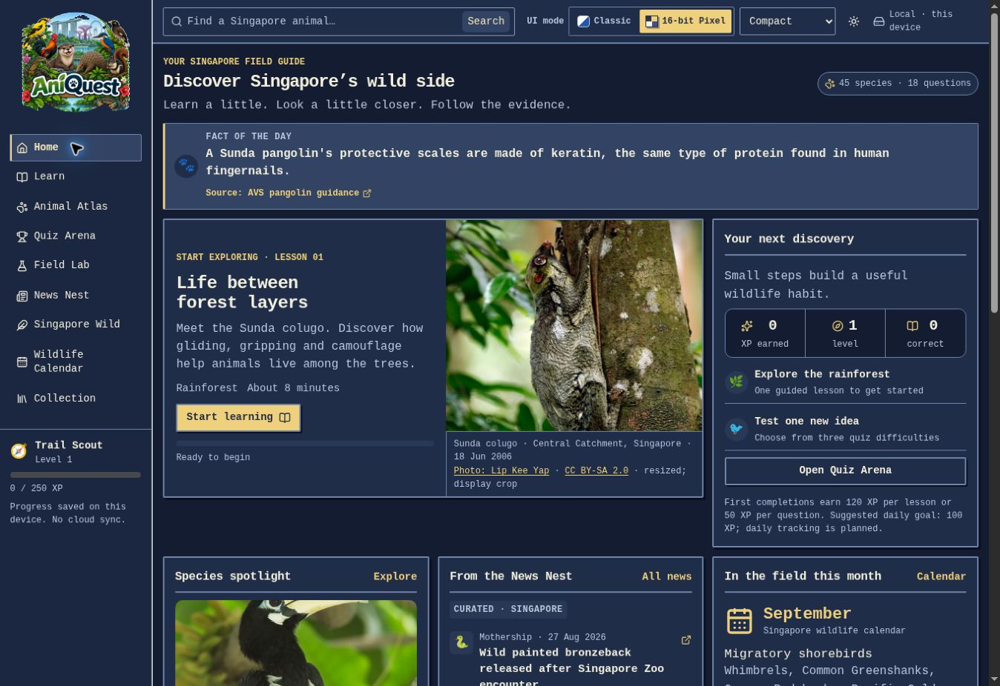

# AniQuest — Singapore wildlife on your own computer

AniQuest is a wildlife learning app for Singapore, with **141 animal profiles**, **873 learning questions** and progress saved on your computer. Explore animals, follow guided lessons, practise quizzes and browse source-linked wildlife information.



*Saved app screenshot from 6 September 2026. It shows earlier counts and labels; the current release has 141 profiles and 873 questions. [More interface screenshots](docs/ui/README.md).*

## Included features

- 91 birds, 29 mammals, 14 reptiles and 7 amphibians, with search and catalogue filters.
- Recognition clues, diet, activity, habitat, encounter guidance, source-linked profile text and conservation evidence.
- Six guided checks per profile, plus 27 practice questions; browser-saved answers, XP and adaptive review.
- Expand/minimise controls on profiles, initially expanded; choices persist on this browser.
- Cytoscape relationship graphs with curved connectors, independent line/outline colours, visible arrowheads, keyboard controls, zoom/reset and profile navigation.
- PhotoSwipe enlargement for bundled photographs, with full image framing and credits.
- Classic, Book and Pixelated themes, light/dark palettes and density controls.
- Wildlife news, seasonal guidance, dated event records and `.ics` export from the included snapshot.
- Windows launch/build/setup/package scripts and detailed continuation prompts.

**Start with [START_HERE.md](START_HERE.md).** The prepared Windows ZIP includes the compiled app and Node.js runtime. A GitHub source download needs the build steps in [WINDOWS_SETUP.md](WINDOWS_SETUP.md).

## Run the prepared Windows ZIP

1. Extract the entire ZIP to a normal folder, such as `C:\AniQuest`.
2. Double-click `Start-AniQuest.cmd`.
3. Use `http://127.0.0.1:5173`. Keep the console open; `Ctrl+C` stops it.

No Sites account, API key, sign-in or remote database is required. Do not open `dist-local/index.html` through `file://`.

For **source from GitHub**, prepare/install Node.js, run `Setup-Development.cmd` once while connected, then `Build-AniQuest.cmd` and `Start-AniQuest.cmd`. See the Windows guide.

## Offline scope

All profile text, questions, graphs, progress and **51 local profile photographs** work offline. **90 other photos are external references**: the local edition shows a source-link placeholder. Their credits remain; no reuse licences are invented and no images are silently downloaded. See [OFFLINE_INVENTORY.json](docs/handoff/OFFLINE_INVENTORY.json).

External sources, fresh news/events, first-time development installation, GitHub operations and cloud-backed Codex assistance need internet. A separately prepared compatible local model can be used with Codex CLI; no AI model is bundled. The app itself does not use AI services.

Progress belongs to the browser and origin. Clearing browser data removes it. Use the same `127.0.0.1:5173` address, port and browser profile.

## Development and checks

```sh
npm ci
npm run dev:local
```

Before release:

```sh
npm test
npm run content:check
npm run offline:inventory
npm run offline:verify
```

`npm test` checks local TypeScript, builds and runs the local suite. `npm start` serves `dist-local` with a dependency-free Node server. Defaults target the local edition. Historical `:site` commands need their original cloud environment and may require Bash.

The ZIP includes source and a build, but not the app's platform-specific development `node_modules`. Run setup once on the target Windows machine and retain its dependencies to rebuild offline.

## Handover

| File | Purpose |
| --- | --- |
| [START_HERE.md](START_HERE.md) | Launch and resume development |
| [WINDOWS_SETUP.md](WINDOWS_SETUP.md) | Windows setup, offline limits, troubleshooting, packaging |
| [CODEX_BUILD_PROMPTS.md](CODEX_BUILD_PROMPTS.md) | Master prompt and 14 focused prompts |
| [CURRENT_STATE.md](docs/handoff/CURRENT_STATE.md) | Provenance, inventory and known limits |
| [ARCHITECTURE.md](docs/handoff/ARCHITECTURE.md) | Source map, flow and compatibility |
| [DO_AND_DO_NOT.md](docs/handoff/DO_AND_DO_NOT.md) | Required behaviours and regressions to avoid |
| [ROADMAP.md](docs/handoff/ROADMAP.md) | Future work, explicitly not completed |
| [ACCEPTANCE_CHECKLIST.md](docs/handoff/ACCEPTANCE_CHECKLIST.md) | Release checks |
| [TEST_REPORT.md](docs/handoff/TEST_REPORT.md) | Actual results and test limits |
| [THIRD_PARTY_NOTICES.md](THIRD_PARTY_NOTICES.md) | Dependency and photo notices |

Older `docs/` files and screenshots are historical. This root handover and `docs/handoff/` describe the export.

React 19, TypeScript and Vite 8 power the standalone UI. Cytoscape 3.34.3, PhotoSwipe 5.4.4, existing Radix/Base UI primitives, CSS tokens, Lucide and Recharts are retained. The lockfile records exact dependencies.

Original authentication, protected admin and shared-progress server source remains for future migration. It is not activated locally; `/room` explains that a separate server is required. The original Sites deployment is unchanged by this export.

Follow [AGENTS.md](AGENTS.md). Preserve sourced claims and real full-frame photos. Publish or push only with the user's authorization in the active session.
