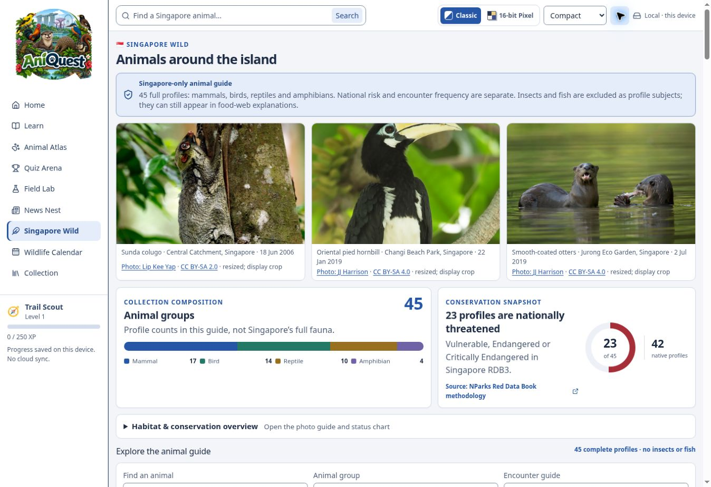
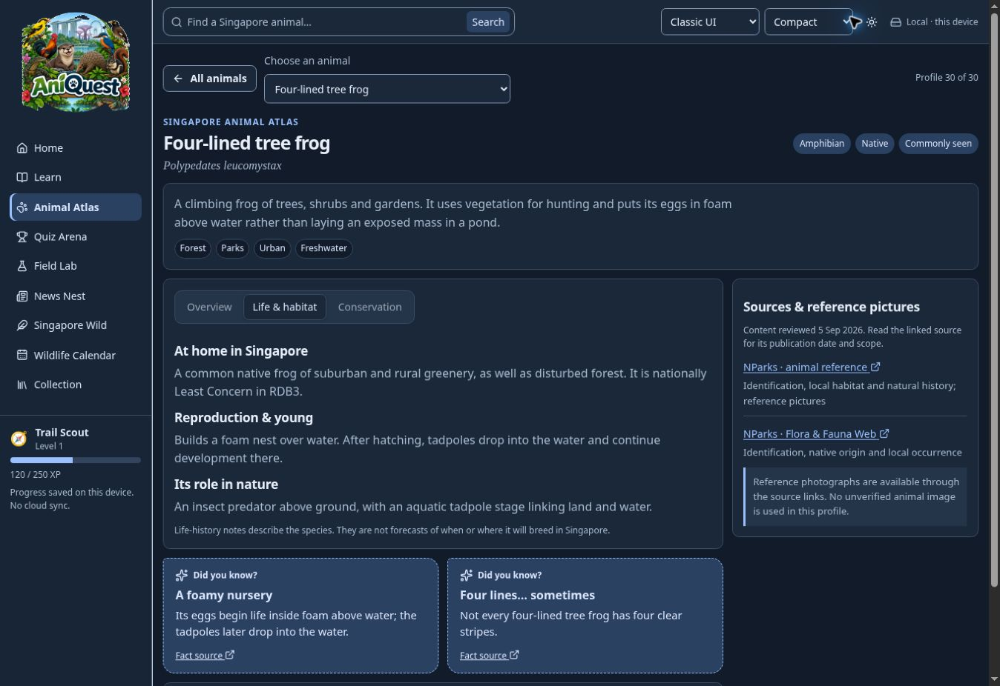
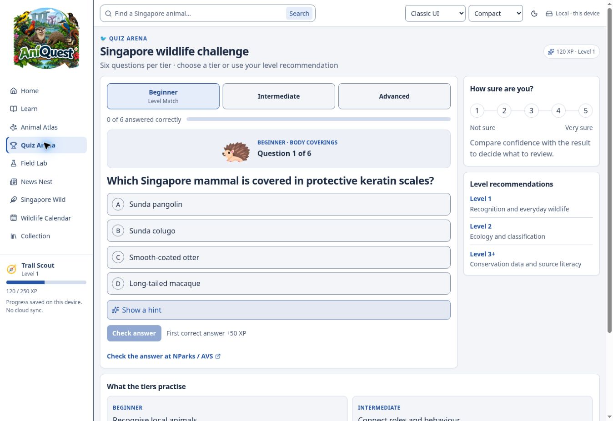

# 🐾 AniQuest — Discover Singapore's wildlife

Explore Singapore's animals, learn how they live, and test your knowledge. AniQuest runs on your computer and saves learning progress in your browser.

**141 animal profiles · 873 learning questions · 3 themes · Windows offline edition**

[Windows setup](WINDOWS_SETUP.md) · [Start here](START_HERE.md) · [Codex development prompts](CODEX_BUILD_PROMPTS.md)

## 🌿 Features

| Feature | What you can do |
| --- | --- |
| 🦉 **Animal guide** | Browse 91 birds, 29 mammals, 14 reptiles and 7 amphibians. Search and filter the catalogue. |
| 📖 **Detailed profiles** | Read identification clues, diet, activity, habitat, fun facts, conservation evidence and safe encounter guidance. Follow source links. |
| 🧠 **Lessons and quizzes** | Answer six guided questions per profile and 27 practice questions. Review missed or hinted answers. |
| 🏆 **Learning progress** | Earn XP and save answers, learning records, badges and progress. Export or import saves with Merge/Replace and a recovery copy. |
| 🕸️ **Interactive relationships** | Explore Cytoscape graphs with curved lines, distinct line and border colours, arrowheads, zoom and keyboard controls. Switch to photo cards. |
| 🔍 **Photo viewer** | Open bundled photos with PhotoSwipe. Zoom, pan or fit the complete image while retaining credits. |
| 🎨 **Choose your style** | Select Classic, Book or Pixelated, with light/dark palettes and density controls. Photographs remain unchanged. |
| ↕️ **Compact profiles** | Minimise or expand seven sections. All start expanded; later choices are saved. |
| 🗓️ **News and calendar** | Read the included wildlife news and seasonal guidance. Export dated events to `.ics` calendar files. |
| 🪟 **Portable Windows edition** | Run the prepared ZIP without installation. Continue development with full source and a master prompt plus 14 focused prompts. |

The offline edition includes **51 local profile photos**. The other **90 profiles** show credited source-link placeholders.

## 📸 Screenshots

These real app captures date from **5–6 September 2026**. They show earlier layouts, counts and labels, before the latest profile graphs and photo viewer. The feature table above describes the current **141-profile** source. No generated interface images are used.

| Home and guided discovery | Singapore wildlife guide |
| --- | --- |
| [](docs/ui/aniquest-ui-mode-and-fact.jpg) | [](docs/ui/aniquest-expansion-classic-light.jpg) |
| **Animal profile in dark mode** | **Quiz Arena** |
| [](docs/ui/aniquest-profile-classic-dark.jpg) | [](docs/ui/aniquest-quiz-classic-light.jpg) |

Select an image to open it at full size. [Screenshot dates and context](docs/ui/README.md).

**Start with [START_HERE.md](START_HERE.md).** The prepared Windows ZIP includes the compiled app and Node.js runtime. A GitHub source download needs the build steps in [WINDOWS_SETUP.md](WINDOWS_SETUP.md).

## Run the prepared Windows ZIP

1. Extract the entire ZIP to a normal folder, such as `C:\AniQuest`.
2. Double-click `Start-AniQuest.cmd`.
3. Use `http://127.0.0.1:5173`. Keep the console open; `Ctrl+C` stops it.

No Sites account, API key, sign-in or remote database is required. Do not open `dist-local/index.html` through `file://`.

For **source from GitHub**, prepare/install Node.js, run `Setup-Development.cmd` once while connected, then `Build-AniQuest.cmd` and `Start-AniQuest.cmd`. See the Windows guide.

## Offline scope

All profile text, questions, graphs, progress and **51 local profile photographs** work offline. **90 other photos are external references**: the local edition shows a source-link placeholder. Their credits remain; no reuse licences are invented and no images are silently downloaded. See [OFFLINE_INVENTORY.json](docs/handoff/OFFLINE_INVENTORY.json).

External sources, fresh news/events, first-time development installation, GitHub operations and cloud-backed Codex assistance need internet. A separately prepared compatible local model can be used with Codex CLI; no AI model is bundled. The app itself does not use AI services.

Progress belongs to the browser and origin. Clearing browser data removes it. Use the same `127.0.0.1:5173` address, port and browser profile.

## Back up or move your progress

Open **Collection → Back up your progress** in the local edition.

1. Choose **Export progress** and keep the downloaded JSON file outside the app folder.
2. On the destination browser or computer, choose that file and review its counts.
3. **Merge** combines completed activities, keeps the higher XP total and retains the latest 500 learning records. **Replace** uses the backup's progress and requires confirmation. Appearance settings are optional.
4. Each import saves one recovery copy on that browser. To undo it, choose **Download previous save**, import that file and select **Replace**. Select appearance settings too if you want to restore them.

Imports accept AniQuest backup schema 1 and older local version 1 saves, up to 2 MiB. Invalid files and failed recovery writes leave existing progress intact. Other question versions remain outside current scores; unavailable activity IDs are listed in the preview. Private progress downloads are excluded from Git and portable packages.

This feature is in the current source/build. The earlier Windows ZIP from 25 September predates it; rebuild updated source to use it.

## Development and checks

```sh
npm ci
npm run dev:local
```

Before release:

```sh
npm test
npm run content:check
npm run offline:inventory
npm run offline:verify
```

`npm test` checks local TypeScript, builds and runs the local suite. `npm start` serves `dist-local` with a dependency-free Node server. Defaults target the local edition. Historical `:site` commands need their original cloud environment and may require Bash.

The ZIP includes source and a build, but not the app's platform-specific development `node_modules`. Run setup once on the target Windows machine and retain its dependencies to rebuild offline.

## Handover

| File | Purpose |
| --- | --- |
| [START_HERE.md](START_HERE.md) | Launch and resume development |
| [WINDOWS_SETUP.md](WINDOWS_SETUP.md) | Windows setup, offline limits, troubleshooting, packaging |
| [CODEX_BUILD_PROMPTS.md](CODEX_BUILD_PROMPTS.md) | Master prompt and 14 focused prompts |
| [CURRENT_STATE.md](docs/handoff/CURRENT_STATE.md) | Provenance, inventory and known limits |
| [ARCHITECTURE.md](docs/handoff/ARCHITECTURE.md) | Source map, flow and compatibility |
| [DO_AND_DO_NOT.md](docs/handoff/DO_AND_DO_NOT.md) | Required behaviours and regressions to avoid |
| [ROADMAP.md](docs/handoff/ROADMAP.md) | Future work, explicitly not completed |
| [ACCEPTANCE_CHECKLIST.md](docs/handoff/ACCEPTANCE_CHECKLIST.md) | Release checks |
| [TEST_REPORT.md](docs/handoff/TEST_REPORT.md) | Actual results and test limits |
| [THIRD_PARTY_NOTICES.md](THIRD_PARTY_NOTICES.md) | Dependency and photo notices |

Older `docs/` files and screenshots are historical. This root handover and `docs/handoff/` describe the export.

React 19, TypeScript and Vite 8 power the standalone UI. Cytoscape 3.34.3, PhotoSwipe 5.4.4, existing Radix/Base UI primitives, CSS tokens, Lucide and Recharts are retained. The lockfile records exact dependencies.

Original authentication, protected admin and shared-progress server source remains for future migration. It is not activated locally; `/room` explains that a separate server is required. The original Sites deployment is unchanged by this export.

Follow [AGENTS.md](AGENTS.md). Preserve sourced claims and real full-frame photos. Publish or push only with the user's authorization in the active session.
